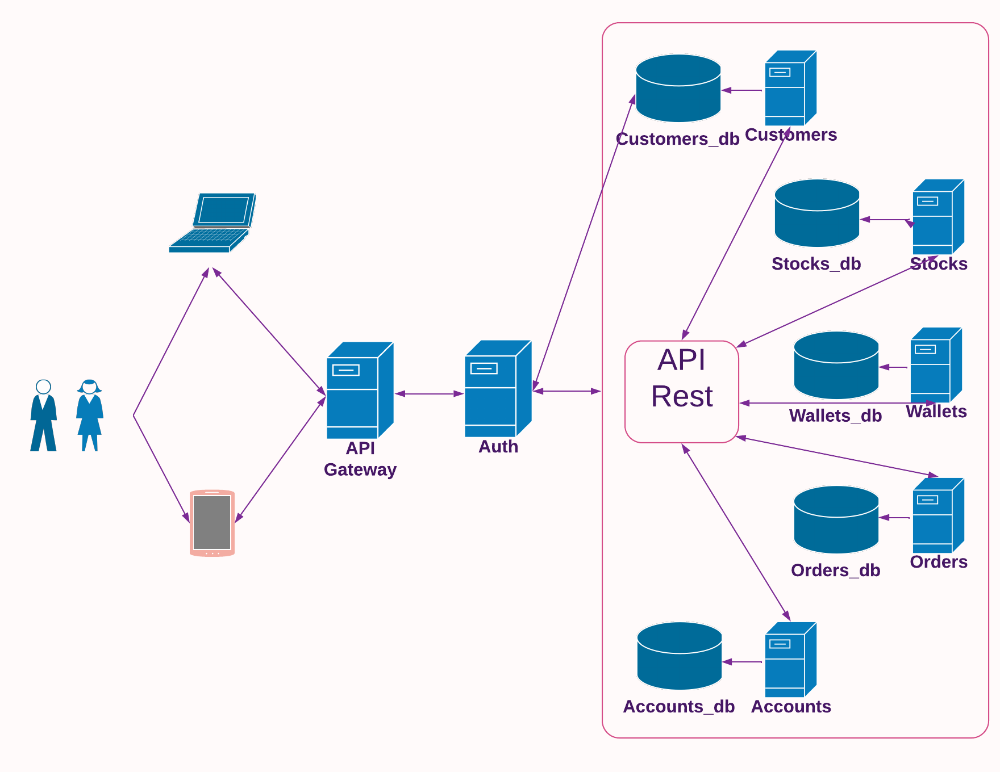

# Desafio Técnico XP

- **Sobre**

Este projeto foi desenvolvido para etapa de **Desafio Técnico** do processo seletivo dos alunos da Turma XP da Trybe.

Conforme o documento de especificação, a idéia era desenvolver uma aplicação que simulasse
ao máximo a realidade do dia a dia da XP.

Além das funcionalidades já definidas, para construção da solução decidi considerar alguns (de vários outros) pontos,
não exigidos ou abordados na ementa, mas que são importantes para o contexto.

Dentre os pontos, o fato da XP possuir mais de 3MM de clientes e mais de 715Bi sob gestão, pressupõe o alto volume
de requisições na aplicação.

Tendo isso em vista, considerando sempre o foco no cliente e na sua melhor experiência, é preciso garantir
o máximo possível disponibilidade e desempenho.

- **Arquitetura**

Levando em consideração os pontos acima, escolhi uma arquitetura de microserviços, onde cada funcionalidade ou módulo está encapsulado e tem sua própria infra, não 'dependendo' de qualquer outro.

Isso garante a 'facilidade' na manutenção, mitiga o impacto em caso de incidentes, facilita a escalabilidade horizontal e diminui débitos técnicos.



# Desafios

- **Bloqueio do event loop**
 >A dificuldade em travar o event loop em caso de multiplas chamadas assincronas no mesmo end point, uma vez que não consegui em tempo hábil aprender e implementar uma solução de fila ou orquestração K8s para expansão horizontal e balanciamento de carga.

- **Reaproveitamento de bibliotecas**
> Considerando que estou usando um monorepo, usar a mesma lib do nível acima para o build dos microserviços, não precisando 'duplicar' o pacote
onde eles são comuns, como nodemon, express e eslint por exemplo.

- **Assincronia durante start do ambiente**
>Houve um problema com assincronismo entre o start do container de app e de banco na rotina para fazer a primeira de dados. Mesmo indicando a dependência entre eles, não era possível desparar a rotina somente após o banco de dados estar no ar. Resolvi realizar a carga através de uma função recursiva.

- **Adaptabilidade do sistema ao ambiente**
>Foi um grande desafio realizar a orquestração dos containers, trabalhar com as variáveis de ambiente e garantir que a aplicação mantivesse a estabilidade, independente do ambiente.

- **Consistência das informações**
>Garantir que todas as tasks da requisição sejam executadas de ponta a ponta, para garantir a consistência das informações e a troca entre os microserviços. Este ainda é um ponto de melhoria no sistema, ainda não consegui chegar em uma melhor resposta para atender essa necessidade.

- **Tratamento das requisições no middleware de autenticação**
>Quando configurei o middleware de autenticação para validar o token JWT, comecei a tomar um erro de cors que só dava pelo swagger, quando fazia a chamada via curl ou client funcionava ok. Notei que antes do navegador enviar a requisição, ele mandava uma requisição do tipo OPTIONS. No meu middleware, eu não tratava esse tipo de requisição e verificava se nela havia algum token no header. Pesquisei sobre esse tipo de requisição, vi que ela serve para 'verificar' as configurações do servidor e os tipos que ele aceita. É uma pré verificação para garantir que a requisição será resolvida. No meu caso, minha rotina tratava essa requisição do tipo options, sem o token, e voltava uma resposta 401, o que gerava o erro de CORS embora toda configuração tivesse sido feita. Como solução, decidi bypassar essa chamada do tipo OPTIONS pelo middleware.

- **Validação das requests recebidas por outros microserviçoes**
>Mais um problema inesperado. Agora referente à validação dos requests trocados entre os próprios microserviços.
Estou verificando uma forma boa de sanar esse problema. Uma das formas que pensei é pegar o user-agent do cliente e ver se é igual ao axios, isso bypassaria a validação de token porém deixaria o sistema vulnerável para ataques eventuais de outros clientes em node. Outra solução que pensei seria resgatar o token recebido pelo cliente e atacchar ele nas sub-requisições.
Consegui resolver usando axios interceptor e criando uma request personalizada com um token válido, usado nas requisições internas. Criei um token sem expiração específica para essas requests internas.

# Aprendizados

- **Arquitetura de Microserviços**
>Realizar um projeto estruturado em microserviços (e ainda funciona como o esperado). Este é o primeiro :D

- **Nova biblioteca**
>Precisava de uma forma para colocar todos os serviços no ar ao mesmo tempo, 
uma vez que cada um estava em uma pasta. Encontrei uma biblioteca para fazer a gestão
dos comandos assincronamente.

- **Documentação de API**
>Nunca havia lidado com Swagger. Foi muito bom conhecer a ferramenta e explorar suas funcionalidades. Realmente, ajuda muito com a documentação, para futuras manutenções e para consulta para construção do frontend.

- **Configuração de Servidor de Proxy**
>Nunca havia lidado com servidorers de proxy, apenas funções como middlewares de validação, dentro de um mesmo projeto. Achei sensacional a experiência de conhecer e implementar um proxy como API Gateway para correto roteamento das requisições e integração dos microserviços.

- **Log de requisições**
>Tive problemas para pegar os logs dos microserviços quando chamados pelo proxy. Descobri uma lib 'morgan' que auxilia nessa parte, trazendo os logs da chamada.

# Melhorias

- **Consistência dos dados**
>Adicionar as integrações de inclusão e atualização em transactions, para garantir a integridade dos dados em todos os ciclos ou rollback quando houver inconsistência.

- **Configuração de Segurança**
>Limitar o endpoint de criação de accounts para receber chamadas somente do microserviço de customers.

- **Remover ID auto incremental**
>Alterar IDs increment para hash forte

# Rodando localmente

- **Para rodar localmente você vai precisar:**

-  [Node](https://nodejs.org/pt-br/)
- [MySQL](https://www.mysql.com/)
- [NPM](https://www.npmjs.com/)

Instale as dependências principais.
```bash
  npm install
```

Instale as dependências dos microserviços.
```bash
  npm run installDeps
```

Inicie o servidor
```bash
  npm start
```

# Rodando com Docker

Certifique-se que você tenha o [Docker](https://www.docker.com/) e [Docker-Compose](https://docs.docker.com/compose/) instalado execute:

```bash
  docker-compose up
```